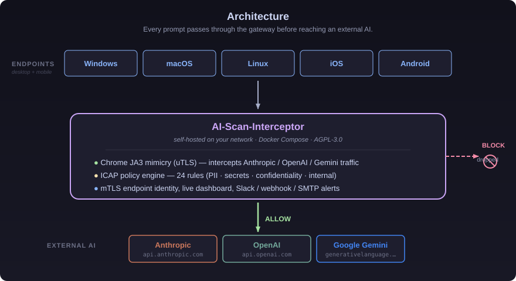

# AI-Scan-Interceptor

**企業ネットワークから外部 AI サービスへのプロンプト送信を可視化・制御する、自前ホスト可能なオープンソース DLP ゲートウェイ。**

[](https://www.gnu.org/licenses/agpl-3.0)
[](https://go.dev/)
[](https://docs.docker.com/compose/)
[]()

[English README](./README.en.md) | 日本語


---

## なぜ AI-Scan-Interceptor が必要か

ChatGPT、Claude、Gemini といった生成 AI サービスの社内利用が当たり前になりつつあります。一方で、**従業員が顧客情報・ソースコード・契約書・個人情報をプロンプトに貼り付け、外部 AI に送信してしまう**事故は、もはや珍しいものではありません。

既存の DLP やプロキシ製品の多くはクラウド型・ブラックボックス・高額で、検出ロジックを自社で監査することができません。

**AI-Scan-Interceptor は、生成 AI に特化した DLP を、Docker Compose 一発で自社ネットワーク内に立ち上げ、検出ロジックを完全に可視化することを目的に作られたオープンソースプロダクトです。**

---

## 主要機能

- **AI サービス特化のプロンプト抽出**  
  ChatGPT / Claude / Gemini のリクエストから、エンドユーザーの入力テキストを正確に抽出します。
- **Anthropic 直接インターセプト（uTLS）**  
  HTTP/2 + uTLS フィンガープリント対策により、Claude API トラフィックも取りこぼしません。
- **ICAP (RFC 3507) ベースのポリシーエンジン**  
  Squid と組み合わせた汎用的なフロー。正規表現・キーワード・分類ルールを YAML で記述できます。
- **エンドポイント Agent (ai-scan-connect)**  
  Windows / macOS / Linux にプロキシ設定と CA 証明書を自動配布。mTLS で社外利用も保護。
- **Web ダッシュボード**  
  リアルタイムでプロンプトログを閲覧、ユーザー別の利用統計、ポリシー違反のアラート。
- **Slack / Webhook / SMTP 通知**  
  検出時に即座に管理者へ通知。
- **完全自前ホスト**  
  外部 SaaS への依存ゼロ。プロンプト内容が第三者のクラウドに送信されることはありません。

---

## アーキテクチャ



エンドポイント（Windows / macOS / Linux / iOS / Android）から外部 AI サービスへの通信は、すべて自社ネットワーク内のゲートウェイを通過します。ICAP ベースのポリシーエンジンで 24 種の検出ルール（PII・シークレット・社外秘・社内リソース）を適用し、ヒットした場合は egress 前に廃棄、許可された通信のみが外部 AI（Anthropic / OpenAI / Google Gemini）へ転送されます。

実装の詳細は各コンポーネントの README を参照してください: `tls-proxy/`, `icap-server/`, `connect/`, `webui/`.

---

## Quick Start

### 必要なもの

- Docker Engine 24+ / Docker Compose v2
- Linux または WSL2（macOS / Windows でも動作確認済み）
- 8080 / 3128 / 3129 / 1344 ポートが空いていること

### 1. クローン & ビルド

```bash
git clone https://github.com/mshirakawa-ssp/ai-scan-interceptor.git
cd ai-scan-interceptor
make certs       # CA 証明書を生成（初回のみ）
docker compose up -d --build
```

### 2. ダッシュボードへアクセス

```
http://localhost:8080
```

初期管理者アカウントは `admin / admin`（初回ログイン後に変更してください）。

### 3. エンドポイントを接続

ブラウザまたは OS のプロキシ設定で以下を指定：

```
HTTPS Proxy: 127.0.0.1:3128
```

`certs/squid-ca.pem` を OS / ブラウザの信頼済み CA にインポートしてください。

### 4. テストする

ブラウザで Claude や ChatGPT を開き、何か質問してみてください。ダッシュボードにプロンプトが記録されます。

---

## 検出例

ダッシュボードに表示されるログサンプル：

```json
{
  "timestamp": "2026-05-19T10:23:41+09:00",
  "user": "alice@example.com",
  "service": "claude.ai",
  "policy_hit": "credit_card_number",
  "severity": "high",
  "action": "logged",
  "prompt_preview": "次のカード番号 4111-****-****-1111 で決済テストを..."
}
```

ポリシーは `config/policies.yaml` で定義します：

```yaml
policies:
  - name: credit_card_number
    pattern: '\b4[0-9]{3}[- ]?[0-9]{4}[- ]?[0-9]{4}[- ]?[0-9]{4}\b'
    severity: high
    action: alert
  - name: my_company_secret
    keywords: ["社外秘", "Confidential", "Internal Only"]
    severity: medium
    action: log
```

---

## Available detection rules

`config/policies/` 配下に、すぐに使えるスターター検出ルール集を同梱しています。カテゴリ別の YAML ファイルとして管理しており、必要なものだけを `include:` で取り込むことも、全部まとめて読み込むこともできます。

| カテゴリ | ファイル | ルール数 | 内容 |
|---|---|---|---|
| PII | `config/policies/pii.yaml` | 9 | Visa / Mastercard / Amex / JCB のカード番号、日本の電話番号、マイナンバー、パスポート番号、米国 SSN、メールアドレス |
| Credentials / Secrets | `config/policies/secrets.yaml` | 9 | AWS Access Key / Secret、Google API Key、GitHub Personal Access Token、OpenAI / Anthropic API Key、JWT、Slack Bot Token、PEM 形式の秘密鍵 |
| Confidentiality | `config/policies/confidentiality.yaml` | 3 | 「社外秘」「Confidential」等の機密区分、個人情報・顧客情報キーワード、カルテ・患者情報など医療コンプラ |
| Internal Resources | `config/policies/internal-resources.yaml` | 3 | GitHub リポジトリ URL、Atlassian Jira / Confluence、Notion ワークスペース URL |

すべてのパターンは Go の `regexp` パッケージ（RE2 構文）で compile 可能であることを確認済みです。

### カスタムルールを追加する

1. `config/policies/` に新しい YAML を作成（既存ファイルを参考に）
2. `config/policies/_index.yaml` の `include:` に追記
3. ICAP サーバーをリロード（policy はホットリロード対応）

```yaml
# config/policies/_index.yaml
version: 1
include:
  - pii.yaml
  - secrets.yaml
  - confidentiality.yaml
  - internal-resources.yaml
  - my-custom-rules.yaml   # ここに追加
```

各ルールは以下のフィールドを持ちます：

- `name` — 一意な識別子（必須）
- `description` — 人間向けの説明
- `pattern` — RE2 正規表現（`pattern` か `keywords` のいずれか必須）
- `keywords` — 文字列リスト（複数ヒットで OR）
- `severity` — `low` / `medium` / `high` / `critical`
- `action` — `log` / `alert` / `block` / `mask`
- `tags` — 任意のタグ配列

---

## ライセンス

本リポジトリのコードは **GNU Affero General Public License v3.0 (AGPL-3.0)** で公開されています。詳細は [LICENSE](./LICENSE) を参照してください。

AGPL は、ネットワーク経由でのサービス提供時にもソース開示義務を課す強いコピーレフトライセンスです。**社内利用および自己ホストでの利用には何の制約もありません。**

### Enterprise / 商用ライセンス

以下のようなケースでは商用ライセンスをご検討ください：

- AGPL の開示義務を回避したい SaaS / 組み込み利用
- 商用サポート、SLA、優先パッチが必要
- マネージドサービスとしての導入
- 監査対応、コンプライアンスドキュメント、運用代行

商用ライセンス・サポートのお問い合わせ： [secscanpro.com](https://www.secscanpro.com) / sales@secscanpro.com

---

## コントリビューション

バグ報告・機能提案・ドキュメント改善・プルリクエスト、すべて歓迎します。  
まずは [CONTRIBUTING.md](./CONTRIBUTING.md) と [CODE_OF_CONDUCT.md](./CODE_OF_CONDUCT.md) をお読みください。

セキュリティ脆弱性の報告は [SECURITY.md](./SECURITY.md) のフローに従ってください。

---

## 応援していただける方へ

このプロジェクトが少しでも役に立った、あるいは「面白い」と感じていただけたら、ぜひ GitHub の Star をお願いします。Star はプロジェクト継続の最大のモチベーションになります。

また、導入事例や運用 Tips を Issue や Discussions で共有していただけると、コミュニティ全体の財産になります。

---

## About

AI-Scan-Interceptor は **SecScanPro 合同会社** が中心となって開発しているオープンソースプロジェクトです。

- Web: [secscanpro.com](https://www.secscanpro.com)
- 所在地: 東京都中央区
- 代表: 白川 信
